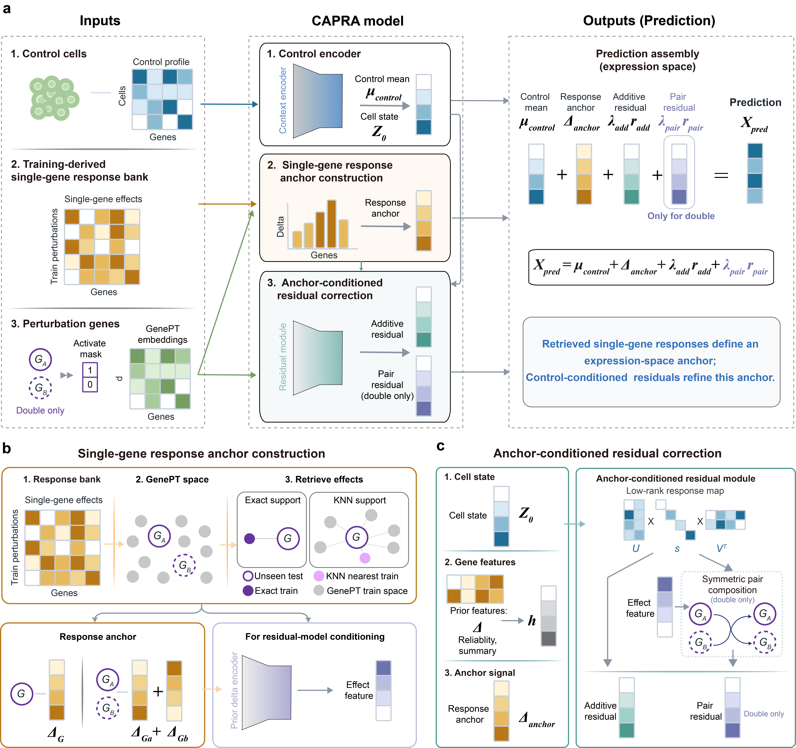

# CAPRA

### Control-Anchored Perturbation Residual Architecture

> A support-aware residual architecture for single-cell genetic perturbation prediction.



## Core Idea

CAPRA decomposes each predicted perturbation profile into:

```text
sampled control state + response anchor + learned residual correction
```

This keeps extrapolation tied to visible response evidence instead of treating
prediction as an unconstrained generative step.

## Design Layers

| Layer | Purpose |
| --- | --- |
| **Control anchor** | Samples the baseline cellular context. |
| **Response anchor** | Uses measured single-gene effects when available, or GenePT-neighbour support when direct evidence is missing. |
| **Residual operator** | Refines the anchor for control context and single- or double-gene composition. |
| **Expression assembly** | Exports calibrated predicted-cell profiles in expression space. |

## What CAPRA Emphasizes

- **Evidence-first prediction**: exact or retrieved single-gene support remains explicit.
- **Constrained extrapolation**: predictions are residual updates around a response anchor.
- **Composition awareness**: double-gene responses model deviations from additive single-gene expectations.
- **Analysis-ready output**: final profiles stay on the expression scale used by downstream single-cell workflows.

## Installation

CAPRA is released as source code in this repository. The demo imports directly
from the local `capra/` directory, so no package installation step is required.

### Reproducible Environment

The pinned dependency set in `requirements.txt` reproduces the environment used
for the Norman demo and CAPRA benchmark wrapper:

```bash
git clone https://github.com/zc-fang/CAPRA.git
cd CAPRA
conda create -n capra python=3.9.7 -y
conda activate capra
python -m pip install --upgrade pip
pip install -r requirements.txt
```

The requirements target the tested CUDA 11.8 setup with PyTorch 2.3.0. On a
CPU-only machine, replace the PyTorch line in `requirements.txt` with
`torch==2.3.0` before installation.

### Import Check

From the repository root:

```bash
python - <<'PY'
import sys
from pathlib import Path

sys.path.insert(0, str(Path("capra").resolve()))
from frame import CAPRA, CAPRAData, load_single_cell_adata

print("CAPRA imports OK")
PY
```
