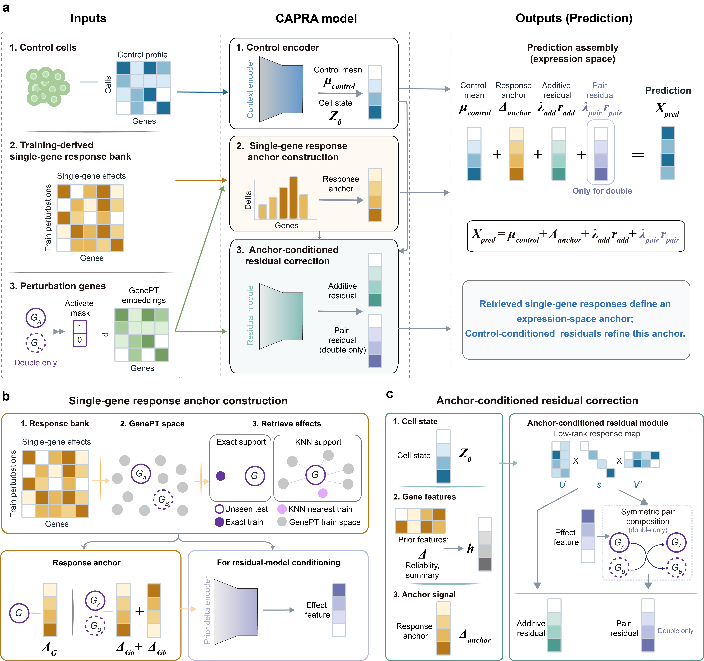

# CAPRA

### Control-Anchored Perturbation Residual Architecture

CAPRA predicts transcriptional responses to unseen single- and double-gene perturbations. It combines a sampled control state with a response anchor built from measured single-gene effects or GenePT neighbours, then learns a residual correction for cell context and gene interactions.



The model and its public API are implemented in `capra/`. The method is described in the manuscript's “Response anchors and model architecture” and “Training” sections.

## Installation

CAPRA is used directly from the source checkout. The tested environment uses Ubuntu 20.04.6, Python 3.9.7 and PyTorch 2.3.0 with CUDA 11.8. Training uses a CUDA-capable NVIDIA GPU.

```bash
git clone https://github.com/zc-fang/CAPRA.git
cd CAPRA
conda create -n capra python=3.9.7 -y
conda activate capra
python -m pip install --upgrade pip
python -m pip install torch==2.3.0 --index-url https://download.pytorch.org/whl/cu118
python -m pip install -r requirements.txt
python -m ipykernel install --user --name capra --display-name "Python (CAPRA)"
python -m notebook
```

Open [the Norman example](demo/demo_norman_subset.ipynb) or [the custom-data example](demo/demo_own_data.ipynb), select **Python (CAPRA)**, and run all cells. Both notebooks include executed outputs and describe their inputs, results and saved files.

## Main API

Prepare an `AnnData` object with normalized `log1p` expression in `X` and unique gene-symbol `var_names`. Set `condition_key` and `perturbation_key` to the columns in `adata.obs` that hold the condition and perturbation labels; use the same column name for both if your data has one label column. The GenePT table is indexed by gene symbol.

```python
import sys
from pathlib import Path
import anndata as ad

sys.path.insert(0, str(Path("capra").resolve()))
from frame import CAPRA, CAPRAData, load_gene_embedding_table

condition_key = "condition"       # adata.obs column for condition labels
perturbation_key = "perturbation"  # adata.obs column for perturbation labels
adata = ad.read_h5ad("your_processed_data.h5ad")
embeddings = load_gene_embedding_table("your_genept_embeddings.pkl")

data = CAPRAData(
    adata=adata, embedding_table=embeddings,
    condition_key=condition_key, perturbation_key=perturbation_key,
)
data.harmonize_perturbation_metadata()
data.register_evaluation_partitions(split_strategy="auto", random_state=1)
data.estimate_trainval_deg_reference(method="t-test")
data.build_control_relative_training_state(
    topk_deg=100, knn_topk=5, knn_temperature=12.0
)

model = CAPRA(data)
model.fit_capra_response_operator(
    output_dir="results", run_name="capra", n_epochs=80,
    min_epochs=20, seed=24, accelerator="gpu"
)
predictions = model.generate_counterfactual_profiles(
    pert_list=data.splits["test"][:3], n_pred=100
)
```

## License

The original CAPRA model code is available under the [MIT license](LICENSE).
